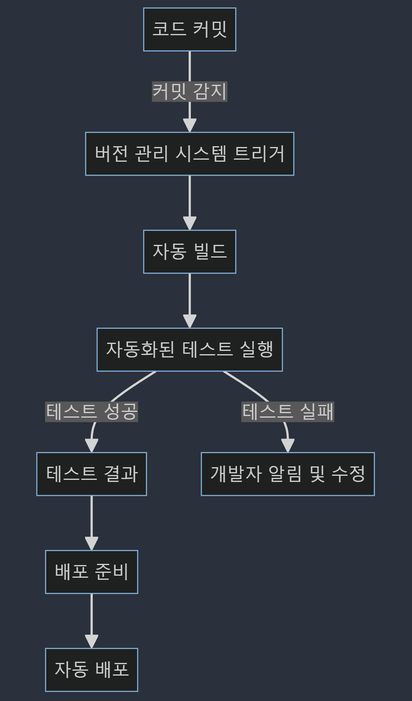

# 2.2.4 CI 파이프라인의 작동 원리
CI(Continuous Integration, 지속적 통합) 파이프라인은 소프트웨어 개발 프로세스에서 중요한 역할을 수행합니다. 
이는 코드 변경사항을 자동으로 빌드, 테스트하고, 메인 코드베이스에 통합하는 과정을 말합니다. 
아래에서는 CI 파이프라인의 작동 원리와, 코드 커밋부터 배포까지의 전체 흐름, 그리고 자동화 테스트와 피드백 루프에 대해 상세히 설명합니다.

## 코드 커밋부터 배포까지의 전체 흐름

1. **코드 커밋**: 개발자는 소스 코드에 변경사항을 만들고 이를 소스 코드 저장소(예: Git)에 커밋합니다.
2. **버전 관리 시스템 트리거**: 커밋이 발생하면, CI 서비스(예: Jenkins, GitHub Actions, Travis CI)가 이를 감지합니다.
3. **자동 빌드**: CI 서버는 최신 코드를 체크아웃하고 필요한 종속성을 설치한 후, 프로젝트를 빌드합니다.
4. **자동화된 테스트 실행**: 빌드가 성공하면, 다양한 자동화된 테스트(단위 테스트, 통합 테스트, UI 테스트 등)가 실행됩니다.
5. **테스트 결과**: 모든 테스트가 성공하면, 코드는 메인 코드베이스에 통합됩니다. 실패한 경우, 개발자에게 알림이 가고, 문제를 수정할 수 있습니다.
6. **배포 준비**: 코드가 메인 브랜치에 성공적으로 통합되면, CI 파이프라인은 코드를 배포 준비 상태로 만듭니다.
7. **자동 배포**: 설정에 따라, 코드는 자동으로 스테이징 또는 프로덕션 환경에 배포됩니다.

## 자동화 테스트와 피드백 루프

- **자동화된 테스트의 중요성**: CI 파이프라인에서 자동화된 테스트는 코드의 품질을 보장하고, 버그를 조기에 발견하는 핵심 수단입니다. 이를 통해 안정적인 소프트웨어를 신속하게 개발할 수 있습니다.
- **피드백 루프**: CI 파이프라인은 빠른 피드백 루프를 제공합니다. 개발자는 코드 변경사항을 커밋한 직후에 테스트 결과를 받아볼 수 있으며, 이를 통해 발견된 문제를 즉시 해결할 수 있습니다. 이는 개발 과정에서의 지연을 최소화하고, 개발자의 생산성을 극대화합니다.
- **품질 관리**: 자동화된 테스트는 코드의 품질을 지속적으로 모니터링하고 관리하는 데 도움을 줍니다. 이는 소프트웨어의 안정성과 사용자 만족도를 높이는 데 기여합니다.

CI 파이프라인은 개발 팀이 코드의 품질을 유지하면서 더 빠르게 소프트웨어를 개발하고 배포할 수 있도록 지원합니다. 자동화된 테스트와 피드백 루프를 통해, 팀은 버그를 신속하게 해결하고, 제품의

source: `{{ page.path }}`
